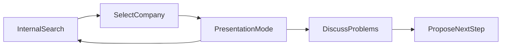

# PRD: внутренний sales-enablement дашборд рейтинга застройщиков

Версия: 0.1  
Дата: 17 июня 2026  
Статус: черновик ТЗ для HTML-прототипа

Связанные документы:

- [sminex-test-report.md](sminex-test-report.md) — пример расширенного отчёта
- [metrics-catalog.md](metrics-catalog.md) — каталог метрик рейтинга
- [../../sources/Решения для девелоперов.md](../../sources/Решения%20для%20девелоперов.md) — услуги Интроверта

---

## 1. Контекст и цель

### Бизнес-контекст

Интроверт Системс публикует рейтинг застройщиков по реакции на входящие заявки. На сайте — агрегированные показатели; по запросу застройщикам обещана расширенная аналитика (секция `discuss-results` в `index.html`).

Дашборд — **внутренний инструмент менеджера Интроверта** для встреч с застройщиками из рейтинга. Он не заменяет публичный сайт и не является клиентским кабинетом.

### User story

> Как менеджер по продажам Интроверта, я хочу быстро найти застройщика из рейтинга, открыть презентационный экран только с его данными и обезличенным рынком, чтобы на встрече обсудить результаты исследования, показать зоны роста и предложить релевантные решения Интроверта — без раскрытия данных других компаний.

### Цели продукта

| Цель | Критерий успеха |
|------|-----------------|
| Быстрый старт встречи | Менеджер находит компанию и открывает презентацию за &lt; 30 сек |
| Безопасная презентация | На экране клиента нет метрик, имён и строк других застройщиков |
| Продажа через диагностику | У каждой проблемной зоны есть связка с услугой Интроверта |
| Доверие к данным | Везде виден дисклеймер идентификации и статус полноты данных |
| Масштаб на будущее | Архитектура допускает второй период исследования и raw events |

### Не цели (v0.1)

- Публичный доступ без авторизации
- Сравнение двух застройщиков по имени
- Выводы о качестве разговора без записей
- Полноценный BI с ad-hoc конструктором графиков (уровень PyGWalker)

---

## 2. Роли и режимы

### Роли

| Роль | Доступ | Что видит |
|------|--------|-----------|
| Менеджер Интроверта | полный внутренний | поиск, список компаний (без чужих метрик в списке), служебные статусы, презентация |
| Застройщик на встрече | только через экран менеджера | одна выбранная компания + обезличенный рынок |

### Режимы интерфейса

#### Internal Search Mode (по умолчанию)

- Поле поиска по названию застройщика
- Селектор периода: сейчас один вариант — **II квартал 2026**
- Список совпадений: название, домен, статус данных (кворум / недостаточно данных)
- **Не показывать** в списке метрики других компаний (скорость, % без звонка и т.д.)
- Кнопка «Открыть презентацию»

#### Presentation Mode

- Активируется после выбора компании
- Скрыт список других застройщиков и внутренние служебные элементы
- Заголовок: название компании, период, дисклеймер
- Только KPI выбранной компании + обезличенные бенчмарки рынка
- Блок «Что проверить» и «Рекомендуемые решения Интроверта»
- Кнопка «Выйти из презентации» (возврат в Internal Search)



---

## 3. Privacy rules

### Разрешено показывать выбранной компании

- Название и домен **только этой** компании
- Агрегаты по её заявкам из `data.json` / будущих `applications`
- Сырые строки заявок и событий **только по этой компании** (когда появятся)
- Обезличенные рыночные агрегаты: среднее, лучшее значение, sample size — **без имён**

### Запрещено

- Таблица или рейтинг с метриками всех застройщиков
- Названия других компаний в сравнительных блоках
- «Вы на 12-м месте» с раскрытием соседей по рейтингу
- Номера телефонов, события, сайты других компаний
- Топ-N с именами конкурентов

### Допустимые формулировки бенчмарка

- «Среднее по рынку: 441 мин»
- «Лучшее значение рынка: 1 мин» (без имени)
- «Выше/ниже среднего на X п.п.»
- «Верхние 25% / середина / нижние 25%» (без имён)

### Технические требования

- Данные других компаний не рендерятся в DOM в Presentation Mode (не только CSS-hide)
- URL/query: `?company=Sminex&period=2026-Q2&mode=present` — без утечки чужих ID в ответе API/JSON
- Будущие raw-файлы: отдельный bundle или filter на этапе сборки per company

---

## 4. Периоды и методология

| Поле | Значение (текущий срез) |
|------|-------------------------|
| Период отчёта | II квартал 2026 |
| Период исследования | 2–8 июня 2026 |
| План заявок на компанию | до 21 |
| Окно наблюдения | 72 часа после заявки |
| Каналы | звонки, SMS, Max, WhatsApp, Telegram |
| Кворум для метрик | ≥ 11 отправленных заявок |

### Дисклеймер (обязателен на каждом экране презентации)

> В метрики попадают только **проверенные контакты (касания)**, по которым точно известно, какой застройщик ответил, по какому каналу и за какое время. Если контакт не удалось надёжно идентифицировать, он **не засчитывается** как ответ компании. Высокая доля «без идентифицированного звонка» может означать и отсутствие звонка, и проблему идентификации.

### Будущее: сравнение периодов

- Селектор периода: `2026-Q2` | `2026-Q4` (пример)
- Для каждого KPI: значение, delta к прошлому периоду, стрелка тренда
- Disabled state, если второй срез ещё не загружен

---

## 5. Информационная архитектура

### Вкладки / экраны Presentation Mode

| # | Экран | Назначение |
|---|-------|------------|
| 1 | **Обзор** | KPI-карточки, сравнение с рынком, executive summary |
| 2 | **Покрытие и скорость** | воронка, распределение времени ответа |
| 3 | **Каналы и касания** | канальная матрица, повторные контакты |
| 4 | **Спам и утечки** | спам по заявкам компании (когда есть events) |
| 5 | **Заявки и события** | таблица applications + drill-down events |
| 6 | **Что дальше** | диагностические карточки + CTA на услуги Интроверта |

### Принцип layout (BI best practices)

- Верх: фильтры (компания, период) + дисклеймер
- Строка 1: 4–6 KPI-карточек с бенчмарком
- Строка 2: 1–2 главных графика (история / воронка / каналы)
- Низ: таблицы и drill-down
- Не более 6–8 визуальных блоков на вкладку

---

## 6. Метрики и формулы

### Источники данных

**Сейчас (v0.1):** `data.json` → `developers[]`, `market`  
**Будущее:** `applications[]`, `events[]`, `spam_contacts[]`, `periods[]`

### KPI-карточки (обзор)

Порядок на экране (слева направо, сверху вниз):

| # | KPI | Поле | Формула / смысл | Бенчмарк рынка |
|---|-----|------|-----------------|----------------|
| 1 | Скорость перезвона | `avg_call_response` | медиана минут до первого идентифицированного звонка | `market.avg_call_response.mean`, `.best` |
| 2 | Медиана скорости перезвона: Будни / Выходные | `first_call_by_day_type` | медиана первого id. звонка по заявкам **с звонком** в срезе будни / выходные; значение `будни / выходные` | `market.first_call_by_day_type` (те же медианы + `n` в подписи) |
| 3 | Заявки без перезвона | `no_call_share` | % заявок без звонка за 72 ч | `market.no_call_share.mean` |
| 4 | Проникновение мессенджеров | `messenger_penetration_share` | % заявок с SMS или мессенджером | `market.messengers.mean` |
| 5 | Касаний на заявку с ответом | derived / `avg_touches_per_responded_app` | касания в рейтинге ÷ заявки с ≥1 касанием (как на сайте) | среднее `avg_touches_per_responded_app` по рынку |
| 6 | Касаний на отправленную заявку | derived / `company-events` | касания в рейтинге ÷ все отправленные заявки | pooled `total_touches` / `applications_sent` по рынку |

SMS и мессенджеры не влияют на скорость перезвона. На вкладке **Заявки** отдельно: «без касаний (любой канал)» — шире, чем «без звонка».

### Каналы

| Блок | Содержание |
|------|------------|
| Доли по каналам | % заявок с контактом в канале (сумма может превышать 100%) |
| Настойчивость | `max_touches_per_app`, `avg_recontacts` |

### Заявки (сводка)

| KPI | Смысл |
|-----|--------|
| Заявок отправлено | N с кворумом |
| Заявок без касаний (любой канал) | нет идентифицированного касания за 72 ч |
| Среднее касаний на заявку | как на обзоре |

Устаревшие поля (не на дашборде): `avg_touches_per_responded_app`, `total_touches` на обзоре, `applications_sent` на обзоре.

### Каналы (доля заявок с контактом по каналу)

| Канал | Поле |
|-------|------|
| Звонок | `channel_share.call` |
| SMS | `channel_share.sms` |
| Max | `channel_share.max` |
| WhatsApp | `channel_share.whatsapp` |
| Telegram | `channel_share.telegram` |

Символы мессенджеров в таблице сайта: `messenger_channel_share.*` — для детального экрана каналов.

### Рыночные агрегаты (только обезличенно)

| Показатель | Поле |
|------------|------|
| Размер выборки | `market.sample_size` |
| Средняя скорость перезвона | `market.avg_call_response.mean` |
| Медиана первого звонка: будни / выходные (pooled) | `market.first_call_by_day_type.weekday`, `.weekend` (поле `n` — заявки с звонком в срезе) |
| Лучшая скорость перезвона | `market.avg_call_response.best` |
| Средняя доля без звонка | `market.no_call_share.mean` |
| Лучшая доля со звонком | `market.no_call_share.best` |
| Среднее проникновение мессенджеров | `market.messengers.mean` |
| Доля спама в событиях рынка | `market.spam_share.mean` |

Поля `market.avg_response` и `market.no_callback_share` остаются в `data.json` для публичного сайта; дашборд их не использует.

### Метрики будущего (требуют raw events)

| Метрика | Источник | Назначение на дашборде |
|---------|----------|------------------------|
| Распределение времени до 1-го контакта | `events.minutes_since_application` | гистограмма: 0–5, 5–15, 15–60, 1–4 ч, 4–24 ч, 24–72 ч |
| Заявки со спамом | `events` where `identified_status != developer` | KPI + список |
| Спам быстрее компании | `spam_beat_company` | диагностическая карточка |
| Уникальные спам-номера | `spam_contacts.from_phone` | таблица для службы безопасности |
| Разбивка по слоту (утро/день/вечер) | `applications.submitted_time_slot` | heatmap / bar |
| Разбивка будни/выходные | `applications.submitted_day_type` | bar chart |
| Медиана первого звонка: будни / выходные | `first_call_by_day_type` в `data.json` | KPI на обзоре (реализовано) |
| CRM-сверка | `applications` + `events` | таблица 9 «без звонка» заявок |
| Delta к прошлому периоду | `periods[]` snapshots | trend на KPI |

### Формат KPI-карточки

Каждая карточка содержит:

1. **Заголовок** — вопрос, на который отвечает метрика  
2. **Значение** компании + единицы (мин, %, шт.)  
3. **Бенчмарк** — среднее рынка и/или лучшее значение  
4. **Delta** — разница с подписью «лучше / хуже / на уровне»  
5. **Статус** — цвет/иконка (только если есть бенчмарк)  
6. **Tooltip** — краткое определение и оговорка идентификации

Пример заголовка: «Скорость перезвона» вместо «avg_call_response».

---

## 7. Диагностические карточки и маппинг на услуги

Шаблон карточки:

| Блок | Содержание |
|------|------------|
| Проблема | формулировка без обвинений |
| Доказательство | цифра из дашборда |
| Что проверить | 2–4 пункта для CRM/телефонии |
| Решение Интроверта | 1–2 услуги со ссылкой на описание |
| Следующий шаг | аудит / пилот / КП / встреча с экспертом |

### Матрица: проблема → метрика → услуга

| Проблемная зона | Триггер (пример) | Услуги Интроверта |
|-----------------|------------------|-------------------|
| **Медленный перезвон** | `avg_call_response` &gt; `market.avg_call_response.mean` | amoCRM Enterprise, маршрутизация лидов, AI-секретарь Matvey |
| **Низкое покрытие звонком** | `no_call_share` &gt; `market.no_call_share.mean` | amoCRM Enterprise, повышение дозваниваемости АТС, AI-секретарь |
| **Мало повторных касаний** | среднее касаний на заявку низкое при умеренном `no_call_share` | AI-секретарь, отдел реактивации, автоматизация в CRM |
| **Нет мессенджеров после недозвона** | `messenger_penetration_share` = 0 при высоком `no_call_share` | Оркестратор мессенджеров, мобильное приложение для продавцов |
| **Спам / утечки заявок** | есть спам-события; спам быстрее компании | Противодействие утечкам, amoCRM Enterprise, защита CRM/АТС |
| **Низкая дозваниваемость** (гипотеза на встрече) | много заявок без звонка + клиент подтверждает проблему АТС | Повышение дозваниваемости АТС (маркировка 41-ФЗ, пул номеров) |
| **Нет прозрачности в CRM** | клиент не может сверить тестовые заявки | amoCRM Enterprise, контроль качества переговоров |
| **Пассивная база** (разговор на встрече) | низкие касания, высокий no_call | Отдел реактивации, EstateData (обогащение интересов) |
| **Нет оценки качества** | обсуждение скриптов и конверсии | Контроль качества переговоров (AI + человек) |
| **Legacy CRM** | клиент на Dynamics / разрозненный стек | Импортозамещение на amoCRM Enterprise Edition |

### Тон для менеджера (подсказки в UI)

- «По нашим тестовым заявкам видим…» — не «вы плохо работаете»
- «Стоит проверить в вашей CRM…» — совместная диагностика
- «Часть контактов могла не попасть в метрики из‑за идентификации» — честность
- «На рынке в среднем…» — контекст без имён конкурентов

---

## 8. UX-flow менеджера

### Сценарий A: подготовка к встрече

1. Открыть дашборд (внутренняя ссылка)
2. Выбрать период `II квартал 2026`
3. Ввести «Sminex» в поиск
4. Просмотреть статус: 20 заявок, кворум есть, raw events — нет / есть
5. Открыть Presentation Mode, пробежать вкладки Обзор → Что дальше
6. Зафиксировать 2–3 диагностические карточки для разговора

### Сценарий B: встреча с клиентом

1. Presentation Mode на проекторе / screen share
2. Обзор: сильные стороны (скорость) + зона роста (покрытие)
3. Воронка и каналы
4. При наличии events — таблица заявок без идентифицированного звонка
5. Экран «Что дальше»: проблемы + услуги + предложение аудита/пилота

### Сценарий C: после появления второго исследования

1. Выбрать период в селекторе
2. На KPI видеть delta к прошлому кварталу
3. Обсудить динамику: «улучшили покрытие на X п.п.»

---

## 9. Визуализации

| Визуал | Данные | Вкладка |
|--------|--------|---------|
| KPI cards (6) | агрегаты + market | Обзор |
| Bullet / bar: компания vs рынок vs best | speed, no_call, messengers | Обзор |
| Funnel | sent → identified call → no call → messenger | Покрытие |
| Histogram времени ответа | events (future) | Покрытие |
| Stacked bar каналов | channel_share | Каналы |
| Bar: касания | total, avg, max | Каналы |
| KPI спама | spam per company (future) | Спам |
| Table applications | applications (future) | Заявки |
| Table events | events filtered by application_id | Заявки |
| Diagnostic cards | rules engine on metrics | Что дальше |

### Интерактивность (уровень v0.1)

- Поиск с debounce
- Переключение вкладок без перезагрузки
- Клик по KPI → скролл к пояснению / вкладке
- Drill-down: клик по строке заявки → события за 72 ч (future)
- Переключатель Internal ↔ Presentation

Не в v0.1: cross-filter между всеми графиками, drag-and-drop полей (PyGWalker-style).

---

## 10. Empty states и edge cases

| Состояние | Поведение UI |
|-----------|--------------|
| Компания не найдена | «Нет в рейтинге. Проверьте написание или выберите из списка.» |
| `insufficient_data: true` | Баннер: метрики не считаются; показать только `applications_sent` и причину |
| `meta.partial: true` | Баннер: данные обновляются, цифры могут измениться |
| Нет raw events | Вкладки Заявки/Спам: «Детализация будет доступна после выгрузки events по компании» + ссылка на процесс |
| Нет спама по компании | «По тестовым заявкам спам-контакты не зафиксированы» (не путать с «спама не было») |
| Нет мессенджеров | «Идентифицированных SMS/мессенджеров не видно» + оговорка идентификации |
| Второй период недоступен | Селектор периода: один активный, второй disabled с tooltip |
| Все метрики сильные | Экран «Что дальше» фокус на удержании, антиспаме, омниканальности как следующем шаге |

---

## 11. Модель данных (целевая)

### Период (`periods[]`)

```json
{
  "id": "2026-Q2",
  "label": "II квартал 2026",
  "study_from": "2026-06-02",
  "study_to": "2026-06-08",
  "generated_at": "2026-06-14T20:13:30.892Z",
  "market": { },
  "developers": [ ]
}
```

### Компания (агрегат) — уже в `developers[]`

Ключевые поля: см. раздел 6.

### Application (будущее)

`application_id`, `developer_name`, `site_url`, `submitted_at`, `submitted_time_slot`, `test_phone_number`, `form_status`, `observation_window_hours`

### Event (будущее)

`event_id`, `application_id`, `event_at`, `minutes_since_application`, `channel`, `from_phone`, `identified_status`, `identified_developer`, `verification_confidence`, `was_first_identified_company_call`

### Сборка per-company bundle (рекомендация)

Перед встречей или по запросу: `build/company-reports/{slug}.json` содержит только одну компанию + market + applications + events. Дашборд в Presentation Mode грузит только этот файл.

---

## 12. Требования к HTML-прототипу (v0.1)

### Стек

- Ванильный HTML/CSS/JS в рамках `projects/developer-response-rating/`
- Данные: `data.json` или `data.js` (как на сайте)
- Без backend; опционально отдельный HTML `dashboard.html`

### Обязательно в прототипе

- [ ] Поиск по `developer_name`
- [ ] Селектор периода (один активный)
- [ ] Presentation Mode toggle
- [ ] 6 KPI с бенчмарками рынка
- [ ] Дисклеймер идентификации
- [ ] Воронка из агрегатов
- [ ] Bar chart каналов
- [ ] 3–5 диагностических карточек (rule-based)
- [ ] Empty state для events
- [ ] Стилистическая связь с сайтом рейтинга (`config.js` accent)

### Не обязательно в v0.1

- [ ] Реальные events / applications
- [ ] Period-over-period
- [ ] Экспорт PDF
- [ ] Авторизация (достаточно «внутренняя ссылка не в публичном deploy»)

### Файловая структура (предложение)

```
projects/developer-rating-dashboard/
  index.html
  config.js
  assets/dashboard.js
  assets/dashboard.css
  docs/dashboard-prd.md
  data.js -> ../developer-response-rating/data.js
```

---

## 13. Метрики успеха продукта

| Метрика | Как измерять |
|---------|--------------|
| Использование перед встречами | кол-во открытий Presentation Mode / месяц |
| Конверсия в следующий шаг | менеджер отмечает «запрошен аудит/КП» (ручной трекинг v0.1) |
| Время до готовности | опрос менеджеров: &lt; 5 мин на подготовку |
| Инциденты утечки | 0 случаев показа чужих данных на встрече |

---

## 14. Риски и ограничения

| Риск | Митигация |
|------|-----------|
| Менеджер случайно покажет рейтинг целиком | Presentation Mode без таблицы всех компаний |
| Клиент спорит с цифрами | CRM-сверка через applications/events; дисклеймер |
| Нет events — слабая продажа | Диагностика на агрегатах + обещание детализации |
| Путаница «нет звонка» vs «не идентифицировали» | Термин «идентифицированный звонок» везде |
| Перегруз экрана | max 6–8 блоков, вкладки |

---

## 15. Roadmap

| Этап | Содержание |
|------|------------|
| **v0.1** | HTML-прототип на `data.json`, поиск, Presentation Mode, KPI, воронка, диагностика |
| **v0.2** | Per-company bundle с `applications` + `events` |
| **v0.3** | Спам-вкладка, CRM-таблица сверки |
| **v0.4** | Второй период, delta/trends |
| **v1.0** | Внутренняя авторизация, экспорт отчёта для клиента |

---

## Приложение A: пример executive summary (генерируется правилами)

Для Sminex при текущих агрегатах:

1. **Сильная сторона:** медиана первого идентифицированного звонка — 1 мин (уровень лучшего рынка).
2. **Зона роста:** 45% заявок без идентифицированного звонка (рынок ~35%).
3. **Каналы:** идентифицированных SMS/мессенджеров не видно.
4. **Следующий шаг:** сверка 9 заявок в CRM; обсудить АТС, AI-секретаря, омниканальность.

---

## Приложение B: промпт для генерации/доработки дашборда

```text
Реализуй HTML-дашборд по спецификации projects/developer-rating-dashboard/docs/dashboard-prd.md.

Роль: внутренний инструмент менеджера Интроверта для встреч с застройщиками.

Обязательно:
- Internal Search + Presentation Mode
- Поиск компании без показа чужих метрик в списке
- KPI с обезличенным рынком из data.json
- Дисклеймер идентификации
- Диагностические карточки с маппингом на услуги из sources/Решения для девелоперов.md
- Empty states для отсутствующих events

Запрещено:
- Таблица всех застройщиков с метриками в Presentation Mode
- Выдуманные events и телефоны
- Имена других компаний в сравнениях

Данные: data.json, период II квартал 2026, исследование 2-8 июня 2026.
```

---

*Документ подготовлен как ТЗ для HTML-прототипа в `projects/developer-rating-dashboard/`.*
